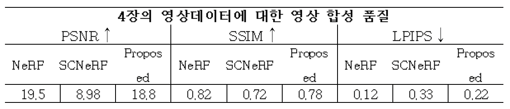

## Title

- 적은 수의 영상을 통한 self-calibrating NeRF 학습

## Contribution

- 적은 수의 영상으로 학습 시 NeRF가 렌더링을 수행하지 못하는 이유를 분석한다.
- 적은 수의 영상으로 학습 시 NeRF가 렌더링을 수행할 수 있는 방법을 제시한다.

## Problem

NeRF는 사실적인 렌더링을 위해서 물체/장면을 다각도에서 촬영한 영상을 이용한다. 렌더링 대상에 따라 다르지만, 대상의 전면(forward-facing)만을 렌더링하는 경우 최소 20장(LLFF 데이터셋)을 이용하고 360도 모습을 렌더링 하는 경우 최소 100장(Blender 데이터셋)을 이용한다.

이러한 데이터 수의 제약에서 벗어나기 위한 연구들이 진행되어 왔으나, 이들은 카메라 파라미터가 이미 주어진 상황에서 수행된 연구들이다. 카메라 파라미터는 Structure from motion이라는 방법을 통해 획득할 수 있다. Structure from motion은 입력으로 주어진 영상들에서 공통된 특징점을 찾고, 이들의 관계를 파악하여 3D 구조나 카메라의 위치를 추정하는 방법이다. 그러나 주어진 영상의 수가 적을 경우 Structure from motion은 정상적으로 동작할 수 없다. 이는 영상 간의 공통 특징을 찾을 수 없거나 그 수가 부족하기 때문이다.

따라서 적은 수의 영상으로 NeRF의 신경망을 학습하기 위해서는 self-calibration 기능이 필요하다. 이와 관련하여, SCNeRF(Self-calibrating Neural Radiance Fields)라는 연구가 있다. SCNeRF는 카메라 내부/외부 파라미터를 학습 매개변수로 설정하고, NeRF의 신경망과 함께 최적화 하는 연구이다. SCNeRF는 카메라 파라미터 학습이 목적이기 때문에 데이터로 사용되는 영상의 수는 고려하지 않았다. 본 논문에서 4장/5장의 영상으로 SCNeRF를 학습하고 렌더링 결과를 확인한 결과, SCNeRF는 적은 수의 영상에 대해서 렌더링을 제대로 수행할 수 없음을 확인할 수 있었다.

따라서 본 논문에서는 SCNeRF가 적은 수의 영상에서 렌더링이 제대로 수행되지 않는 이유를 분석하고, 이를 해결할 수 있는 방법을 제안한다.

## Analysis

본 논문에서는 NeRF에서 사용하는 positional-encoding의 역할과 의미에 대해서 재검토 하였다. NeRF에서 사용하는 positional-encoding은 렌더링되는 이미지의  quality를 높이기 위한 방법이다. NeRF 신경망의 입력으로는 광선 위의 3차원 좌표값과 광선의 방향값이 사용된다. 이는 5차원 입력인데, 이러한 차원이 낮은 입력으로는 고차원의 사실적인 이미지를 표현할 수 없다. 특히나 신경망의 경우 낮은 차원으로 편향되는 특징을 갖고 있기 때문에 더욱 어렵다. 따라서 NeRF는 5차원 입력을 cos, sin으로 구성된 함수에 넣어서 최대 60차원까지 높이는 방식을 사용한다.

positional-encoding은 입력값을 고차원, 고주파로 만드는 함수이다. 고주파 함수의 개형은 많은 지역 최저점과 최대점으로 구성되어 있다. 많은 지역 최저/최대점은 특정값으로의 수렴을 어렵게 만든다. NeRF에서 가장 중요한 개념은 가상의 광선을 이용하는 것이다. 광선 위의 점을 샘플링하고 신경망을 통해 각 점의 color와 density를 예측한다. NeRF는 주어진 데이터를 통해서 광선 위의 샘플들이 실제와 근사한 값을 같도록 overfitting 시키는 작업이다. 일반적인 NeRF의 경우 카메라 파라미터가 데이터로 주어지기 때문에 광선이 고정되어 있는 것과 같다. 따라서 positional-encoding을 이용해서 과적합을 시키면, 실제와 근사한 결과 이미지를 얻을 수 있다. 그러나 SCNeRF는 카메라 파라미터를 예측해야하는 모델이다. 즉, 카메라 파라미터 예측 과정에 positional-encoding 과정을 이용할 경우, 광선이 계속해서 움직이는 문제가 발생한다. 

## Solution

학습 시작 단계에서는 낮은 주파수의 값을 사용하고 점차 학습이 반복 될수록 높은 주파수의 값을 사용하도록.

$$
\begin{cases}
0 && && && if & La < k \\
\frac{1-cos((La - k)\pi)}{2} && && && if & 0 \le La - k \lt 1 \\
1 && && && if & La > k
\end{cases}
$$

- $a$: 학습 파라미터
    - 현재 모델의 학습이 어느정도 진행되었는지를 알려주는 척도. (0 ≤ $a$ ≤ 1)
    - 학습이 진행될수록 1에 가까워지도록.
- k: 주파수 인덱스
    - positional-encoding의 지수 값을 주파수 인덱스라고 표현.
    - $cos(2^1\pi x), sin(2^1\pi x),cos(2^2  \pi x), sin(2^2 \pi x), ... , cos(2^k \pi x), sin(2^k \pi x)$ 에서 지수 값을 의미. (1, 2, … $k$)
- $L$: 4(방향 값) or 10(위치 값)

위 과정을 거치면 [1, 1, 1, … , 0.3, 0, 0] 과 같은 결과를 얻을 수 있는데, 이를 positional-encoding과 곱해서 positional-encoding 값들 중 사용할 것을 선택하고, 스케일링을 적용.

## Experiment

- Dataset
    - Lego 데이터셋 (4장, 5장)
    - ship, chair, marbles 데이터셋 (4장)
    - 직접 촬영한 가정용 스탠드 선풍기 (4장, 5장)

- Environment
    - Graphic card: RTX 3090
    - Memory: 32GB
    - OS: Windows11

- Architecture
    - SCNeRF(coarse model + fine model) + 점진적 위치 인코딩

- Options
    - SCNeRF의 camera noise는 0.15로 설정 → 이 값이 크면 학습 과정이 불안정해짐
    - Iteration: 200K
        - ~50K : 카메라 파라미터 학습
        - 100K ~ : SCNeRF의 손실함수 적용

## Result

- 4장의 Lego 데이터셋으로 학습한 결과
    - PSNR은 109.13%, SSIM은 8.33%, LPIPS는 33.33% 개선
        
        
        
        
        
- 5장의 Lego 데이터셋으로 학습한 결과
    - PSNR은 108.2%, SSIM은 19.7%, LPIPS는 44.74% 개선
        
        
        
        